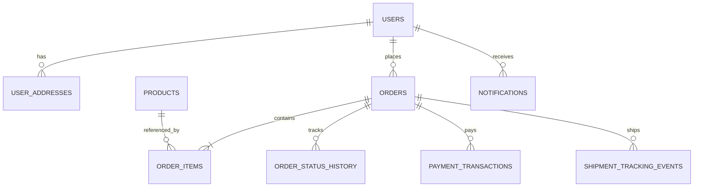

# ERD Logical - Golf Store

## 1. Danh sách thực thể
- `users`
- `user_addresses`
- `products`
- `orders`
- `order_items`
- `order_status_history`
- `payment_transactions`
- `shipment_tracking_events`
- `notifications`
- `audit_logs`

## 2. Quan hệ logic (cardinality)
1. `users (1) -> (N) user_addresses`
2. `users (1) -> (N) orders`
3. `orders (1) -> (N) order_items`
4. `products (1) -> (N) order_items`
5. `orders (1) -> (N) order_status_history`
6. `orders (1) -> (N) payment_transactions`
7. `orders (1) -> (N) shipment_tracking_events`
8. `users (1) -> (N) notifications`
9. `audit_logs` tham chiếu lỏng theo cặp (`entity_type`, `entity_id`).

## 3. Optionality quan trọng
- `orders.user_id`: bắt buộc.
- `order_items.product_id`: bắt buộc (giữ FK integrity).
- `payment_transactions.provider_txn_code`: bắt buộc, unique.
- `notifications.sent_at`: optional, set khi trạng thái chuyển `SENT`.

## 4. Mermaid ERD (logic)

## 5. Quy tắc tích hợp dữ liệu
- Không xóa cứng dữ liệu giao dịch (`orders`, `order_items`, `payment_transactions`).
- Snapshot dữ liệu sản phẩm tại `order_items` để đảm bảo lịch sử doanh thu không phụ thuộc thay đổi sản phẩm hiện tại.
- Tracking đơn hàng hiển thị từ hợp nhất:
1. `order_status_history` (trạng thái nghiệp vụ nội bộ).
2. `shipment_tracking_events` (sự kiện giao vận).
